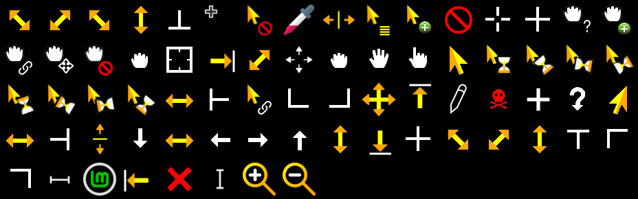
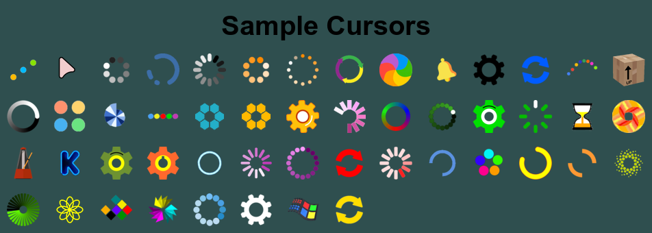

I've been creating quite a lot of cursor themes. This shows the different cursors in a theme. 

The only difference between the different themes is the wait cursor. &nbsp; I designed these to be used with a dark theme. 
Here are samples of the wait cursors in those themes.

 

Download and extract the tar file into <b>~/.icons</b> folder for personal use. 
Or <b>/usr/share/icons</b> for global use.
  To show the thumbnail properly in the settings->themes app, the thumbnail.png in any theme should be copied into <b>/usr/share/cinnamon/thumbnails/cursors</b> folder while renaming it as the theme name.  
Example:  If using <b>Bounce</b> then the command would look like this: 
<b>sudo cp ~/.icons/Bounce/thumbnail.png /usr/share/cinnamon/thumbnails/cursors/Bounce.png</b>
  
These can be used in KDE also.  The sizes are 24px 32px and 48px, and some have 64px.
  My favorites are the Gear, Orange-Gear, and Spinner. One of the more difficult ones I created is the Metronome. &nbsp; Getting the swinging pendulum was fun.
