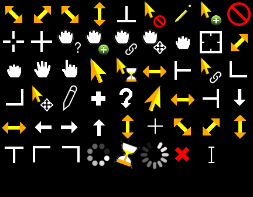

This is a collection of 6 cursor themes.
The only difference between them is the wait cursor.

Three of the wait cursors can be seen in the sample above, bottom left corner. 
AKcursors.blk, AKcursors.hour and AKcursors.spinner.

Copy any one of these folders into your ~/.icons folder for personal use.
Or /usr/share/icons for global use.

To use them, goto settings->themes  To show the thumbnail properly in the settings-themes app, the thumbnail.png must be copied into /usr/share/cinnamon/thumbnails/cursors folder. 
Example:  If using AKcursors.blk then the command would look like this: 
sudo cp ~/.icons/AKcursors.blk/thumbnail.png /usr/share/cinnamon/thumbnails/cursors/AKcursors.blk.png

